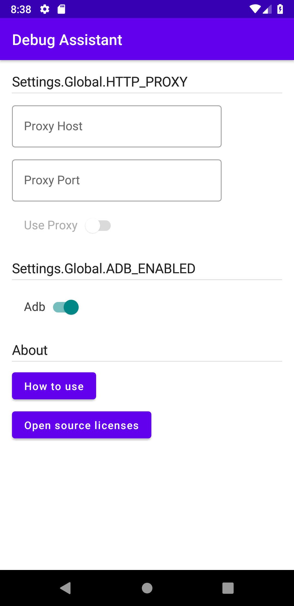
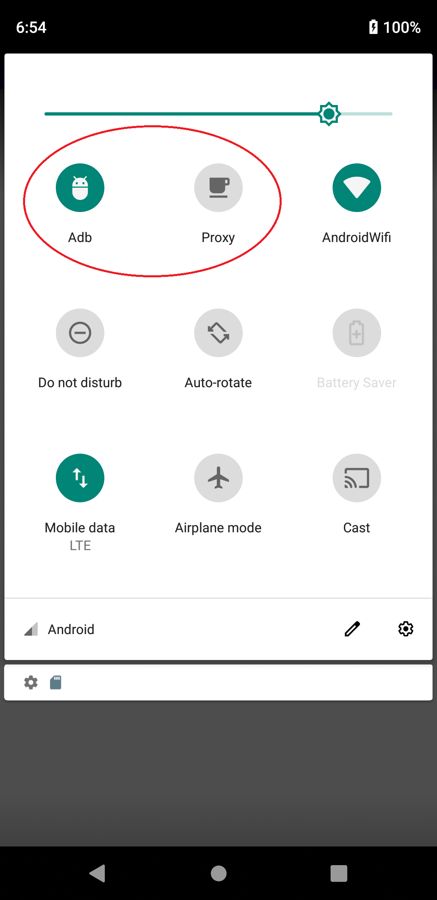
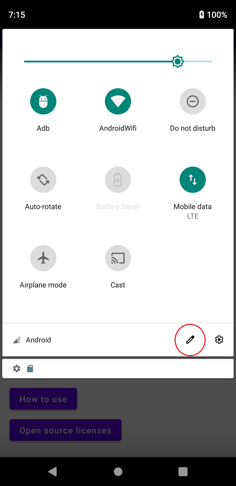
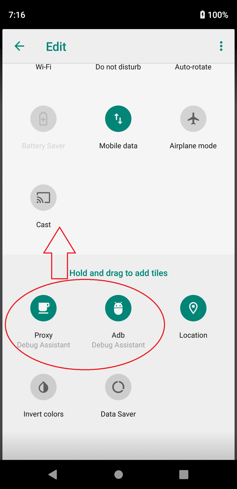
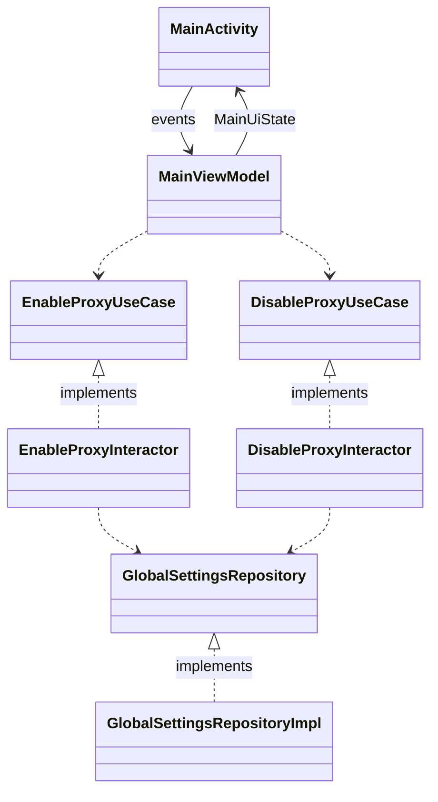

# Debug Assistant

Assists Android Developers!

## Features

* Proxy toggle in quick settings
* Adb toggle in quick settings

 

## Install

1. Download and install from [Google Play](https://play.google.com/store/apps/details?id=com.nagopy.android.debugassistant)
2. Grant WRITE_SECURE_SETTINGS permission by following command  
`adb shell pm grant com.nagopy.android.debugassistant android.permission.WRITE_SECURE_SETTINGS`
3. Input your proxy settings
4. Add quick setting icons

 

## Architecture

```
debugassistant
    ├─data
    │  └─repository
    │      │  GlobalSettingsRepository.kt
    │      │  UserPreferencesRepository.kt
    │      │  ...
    │      └─impl
    │              GlobalSettingRepositoryImpl.kt
    │              UserPreferencesRepositoryImpl.kt
    │              ...
    ├─domain
    │  │  ProxyInfo.kt
    │  │  ...
    │  └─usecase
    │      │  EnableProxyUseCase.kt
    │      │  DisableProxyUseCase.kt
    │      │  ...
    │      └─interactor
    │              EnableProxyInteractor.kt
    │              DisableProxyInteractor.kt
    │              ...
    └─ui
        ├─main
        │      MainActivity.kt
        │      MainViewModel.kt
        │      MainUiState.kt
        │      ...
        └─tile
                ProxyTileService.kt
                ...
```



## License

```
Copyright 2022 75py

Licensed under the Apache License, Version 2.0 (the "License");
you may not use this file except in compliance with the License.
You may obtain a copy of the License at

   http://www.apache.org/licenses/LICENSE-2.0

Unless required by applicable law or agreed to in writing, software
distributed under the License is distributed on an "AS IS" BASIS,
WITHOUT WARRANTIES OR CONDITIONS OF ANY KIND, either express or implied.
See the License for the specific language governing permissions and
limitations under the License.
```
